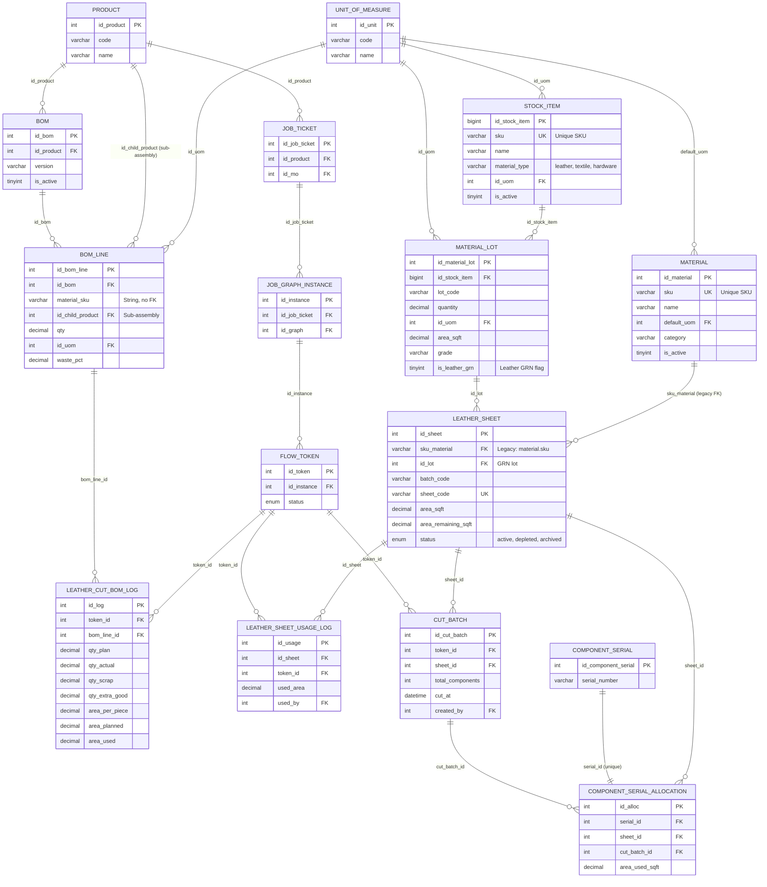

# Material Pipeline ER Diagram

**Generated:** December 2025  
**Purpose:** Entity-Relationship diagram for Material Pipeline (GRN → Material → Leather Sheet → CUT → BOM → DAG)  
**Task:** Task 13.15 — Schema Mapping & Material Pipeline Blueprint

---

## ER Diagram (Mermaid)



---

## Key Relationships Summary

### 1. Material Master Data Flow
```
STOCK_ITEM (source of truth)
    ↓ (id_stock_item)
MATERIAL_LOT (GRN lot)
    ↓ (id_lot)
LEATHER_SHEET (physical sheet)
```

**Legacy Path:**
```
MATERIAL (legacy)
    ↓ (sku_material)
LEATHER_SHEET (legacy FK)
```

### 2. BOM to CUT Flow
```
PRODUCT
    ↓ (id_product)
BOM
    ↓ (id_bom)
BOM_LINE
    ↓ (bom_line_id)
LEATHER_CUT_BOM_LOG (CUT results)
```

### 3. Leather Sheet Usage Flow
```
LEATHER_SHEET
    ↓ (id_sheet)
LEATHER_SHEET_USAGE_LOG (usage per token)
    ↓ (token_id)
FLOW_TOKEN (DAG token)
```

### 4. CUT Batch Flow
```
FLOW_TOKEN (DAG token)
    ↓ (token_id)
CUT_BATCH (cut operation)
    ↓ (sheet_id)
LEATHER_SHEET (sheet used)
    ↓ (sheet_id)
COMPONENT_SERIAL_ALLOCATION (component allocation)
```

### 5. DAG Integration Flow
```
JOB_TICKET (work order)
    ↓ (id_job_ticket)
JOB_GRAPH_INSTANCE (graph execution)
    ↓ (id_instance)
FLOW_TOKEN (work unit)
    ↓ (token_id)
LEATHER_CUT_BOM_LOG (CUT results)
LEATHER_SHEET_USAGE_LOG (sheet usage)
CUT_BATCH (cut batch)
```

---

## Foreign Key Constraints

### Direct FK Constraints (Enforced)
- `material_lot.id_stock_item` → `stock_item.id_stock_item`
- `leather_sheet.sku_material` → `material.sku` (legacy)
- `leather_sheet.id_lot` → `material_lot.id_material_lot`
- `bom.id_product` → `product.id_product`
- `bom_line.id_bom` → `bom.id_bom`
- `leather_cut_bom_log.token_id` → `flow_token.id_token`
- `leather_cut_bom_log.bom_line_id` → `bom_line.id_bom_line`
- `leather_sheet_usage_log.id_sheet` → `leather_sheet.id_sheet`
- `leather_sheet_usage_log.token_id` → `flow_token.id_token`
- `cut_batch.token_id` → `flow_token.id_token`
- `cut_batch.sheet_id` → `leather_sheet.id_sheet`
- `component_serial_allocation.serial_id` → `component_serial.id_component_serial`
- `component_serial_allocation.sheet_id` → `leather_sheet.id_sheet`
- `component_serial_allocation.cut_batch_id` → `cut_batch.id_cut_batch`

### String References (No FK Constraint)
- `bom_line.material_sku` → `stock_item.sku` (string match, no FK)
- `bom_line.material_sku` → `material.sku` (string match, no FK)

---

## Notes

1. **Dual Material Master:** Both `material` and `stock_item` exist with overlapping purposes
2. **Legacy FK:** `leather_sheet.sku_material` references `material(sku)` (legacy)
3. **New FK:** `leather_sheet.id_lot` references `material_lot` (new, Task 13.10)
4. **String FK:** `bom_line.material_sku` is a string without FK constraint
5. **No Direct Link:** `bom_line` has no direct FK to `stock_item` or `material` (only string `material_sku`)

---

**End of ER Diagram**

