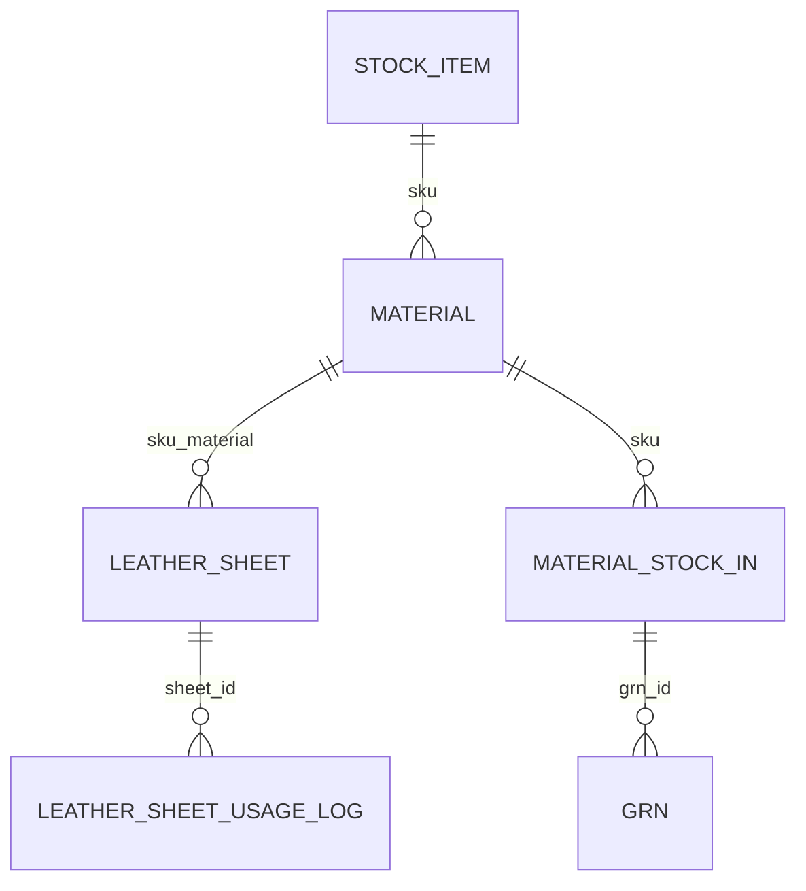

# Task 13.15 — Schema Mapping & Material Pipeline Blueprint (NEW)
Status: Ready
Owner: BGERP Engineering
Module: Materials / GRN / Leather Sheet / CUT / DAG
Priority: Critical
Type: Architecture / System Alignment
Sprint: DAG S13

## 1. Background / Why This Task Exists
ระบบปัจจุบันมีการเชื่อมโยงระหว่างหลายโมดูล:
- GRN → material → leather_sheet → CUT → BOM → DAG
- มี legacy schema + new schema ผสมกัน
- หลายจุดใช้ SKU จากคนละตาราง (`material`, `stock_item`, `leather_sheet`)
- บางจุด FK พังเพราะไม่มี material record
- DAG behavior ต้องการ material_sku แต่ไม่รู้ source of truth
- การ Implement ฟีเจอร์ใหม่มีความเสี่ยงหลงทิศทางเพราะขาดภาพรวม

จึงต้องมี Task กลางเพื่อจัดระเบียบ schema ทั้งหมด
ก่อนดำเนิน Task 13.16–13.20 ต่อไป

## 2. Objective
สร้าง Material Pipeline Schema Blueprint V1 ประกอบด้วย:
1. Schema Extraction ของทุกตารางที่เกี่ยวข้อง
2. ER Diagram (Mermaid)
3. Foreign Key Mapping
4. Master Data Ownership Model (Source of truth: SKU / material)
5. Material Flow Lifecycle
6. Gap Analysis & Risk Points
7. Recommendations สำหรับ alignment

เป้าหมาย:
- ทำให้ Agent เข้าใจระบบโดยไม่หลง
- ทำให้คุณวางแผน 13.16–13.20 แบบมั่นคง
- ปิดปัญหา FK mismatch / SKU mismatch

## 3. Deliverables

### D1. Schema Dump File
ไฟล์: `docs/architecture/schema_raw_dump.md`
- รวมผลลัพธ์จาก `SHOW CREATE TABLE` และ `DESCRIBE` สำหรับทุกตารางที่เกี่ยวข้อง
- ใส่ foreign keys, indexes, comment

### D2. ER Diagram
ไฟล์: `docs/architecture/material_pipeline_er.md`
- Mermaid ER diagram แสดงความสัมพันธ์ทั้งหมด เช่น

### D3. Material Flow Lifecycle
ไฟล์: `docs/architecture/material_flow_lifecycle.md`
ประกอบด้วยขั้นตอน:
- GRN intake
- material register
- lot creation
- leather_sheet creation
- sheet usage → CUT BOM → CUT Behavior
- WIP → QC → Finish

### D4. Master Data Ownership Definition
ไฟล์: `docs/architecture/material_master_ownership.md`
ตอบคำถาม:
- SKU source of truth อยู่ที่ไหน?
- stock_item ทำหน้าที่อะไร?
- material เป็น master อะไร?
- leather_sheet อ้างอิงอะไร?
- ใครเป็นผู้ gen SKU? (ระบบ)

### D5. Gap & Conflict Report
ไฟล์: `docs/architecture/material_schema_gap_report.md`
เช่น:
- FK mismatch (stock_item.sku vs material.sku)
- leather_sheet สร้างไม่ได้เพราะ material ไม่มี record
- CUT pipeline ไม่รู้ material master สี/ประเภท
- DAG behavior ต้องใช้ material_sku แต่ไม่มี mapping
- qc_policy เก็บค่า '0' มาจาก legacy

## 4. Acceptance Criteria
- Schema dump ครบทุกตาราง
- ER diagram ครอบคลุมและอ่านง่าย
- master data ownership ชัดเจน
- lifecycle แสดง flow จริงครบทั้งหมด
- gap report ระบุ root cause ชัดเจน
- Agent สามารถอ่านเอกสารและทำ Task ถัดไปได้โดยไม่หลง
- คุณสามารถเห็น big picture ของ Material Pipeline

## 5. Developer Checklist (สำหรับ Agent)
- [ ] Query schema (SHOW CREATE TABLE / DESCRIBE)
- [ ] Compile เป็น schema dump
- [ ] Generate ER diagram
- [ ] เขียน lifecycle
- [ ] เขียน master ownership
- [ ] เขียน gap report
- [ ] Propose alignment

## 6. Completion Note
Task 13.15 นี้คือขั้นตอน "Reset ภาพรวมระบบ" เพื่อ Align วัสดุ → GRN → Leather Sheet → CUT → BOM → DAG ให้พร้อมสำหรับ Task 13.16 และ pipeline ระยะยาวของ BGERP.
