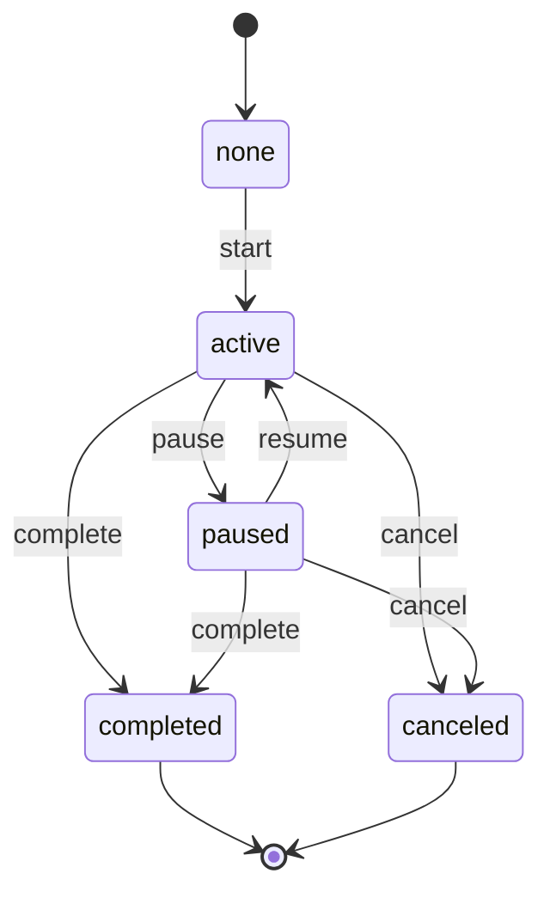

# CUT Batch Execution Model (Hatthasilpa Production)

## Purpose
Define the **behavior-level execution model** for CUT batch work so that multiple tokens resolve into a **single CUT card** and a **single batch session**, with clear modal behavior and session controls.

This specification derives from:
- `HATTHASILPA_CANONICAL_PRODUCTION_SPEC` (Level 0)
Any conflict must be resolved in favor of the Canonical.

## Scope
**In scope**
- Grouping multiple tokens into a single CUT card.
- Batch-level CUT sessions (one session per group).
- UI + session semantics only.

**Out of scope**
- Pool logic.
- Token binding.
- Canonical ontology changes.
- Timer engine internals.

---

## Definitions
- **group_key**: Deterministic identifier for a CUT batch.
- **CUT card**: The work-queue UI card representing a batch.
- **Batch session**: The single session that governs CUT execution for a group.

---

## Deterministic `group_key`
A group_key **MUST** be derivable deterministically and consistently across tokens.

### Rule priority (first match wins)
1. **If `cut_batch_id` exists** on the token:
   - `group_key = "cut_batch:" + cut_batch_id`
2. **Else compute from stable CUT identity tuple**:
   - `group_key = "cut_legacy:" + hash(tenant_id | order_id | component_id | size_group | material_id | cut_spec_version | due_date_bucket)`

### Notes
- **Only stable fields** are allowed in the legacy tuple; missing fields use explicit `null` placeholders to preserve determinism.
- Changes to the tuple require explicit versioning (e.g., `cut_legacy:v2`).

---

## Execution Model
### CUT Card
- Exactly **one CUT card** per `group_key`.
- Card aggregates Need/Done/Remaining at the **batch level**.
- Card status is **derived from batch session**, not per-token sessions.

### Batch Session
- Exactly **one active batch session** per `group_key`.
- Batch session is the **only authoritative session** for pause/resume/cancel.
- Per-token sessions are **legacy projections**, not authoritative.

### Modal Resolution
- Any token-level entry **MUST resolve to the same batch session** via `group_key`.
- If no batch session exists, modal starts in a **pre-start** state until user starts the batch.

---

## Invalid / No-Session Resolution
- If no batch session exists for a group_key, modal **MUST** open in pre-start state.
- UI **MUST NOT** infer session state from legacy per-token records or empty `cut_session` objects.

---

## Actions (Batch-Level)
- **Start**: creates/activates batch session for group.
- **Resume**: resumes paused batch session.
- **Pause**: pauses active batch session.
- **Cancel**: cancels batch session; terminal.
- **Complete**: completes batch session; terminal (should require all tokens done).

All actions **apply to the batch session**, and the UI reflects that across all tokens in the group.

---

## Session Lifecycle

### State Rules
- Only one `active` session per `group_key`.
- `canceled` and `completed` are terminal; no resume.

---

## UI Expectations
### Work Queue
- One card per group_key.
- Displays aggregate counts and **batch session state**.
- Card status mirrors batch session (`active`, `paused`, `none`).

### Modal
- Opening from any token/card shows **batch session**.
- Displays list of tokens in batch (read-only status per token).
- Single set of controls for Pause/Resume/Cancel/Complete.

### Core Projection
- Batch session status maps to canonical `session_status`:
  - `active` → `active`
  - `paused` → `paused`
  - `none/canceled/completed` → `none`
- Optional `time_summary` projection for display only.

---

## Migration & Compatibility
### Legacy per-token `cut_session` records
- Remain as historical ledger; **do not delete**.
- Runtime resolution logic:
  1. Resolve group_key for all CUT tokens.
  2. Aggregate existing sessions by group_key.
  3. If multiple active/paused sessions exist:
     - Select the **most recently updated** session as the batch session.
     - Mark others as **superseded** (soft-closed) for the group.

### Compatibility mode
- Batch session becomes authoritative for UI/control.
- Per-token sessions remain visible only as legacy projection data.

---

## Acceptance Criteria
- One CUT card per group_key across all entry points.
- One active batch session per group_key.
- All Pause/Resume/Cancel actions affect the batch session.
- Modal from any token path resolves to the same batch session.
- Legacy per-token sessions do not cause duplicate UI cards or conflicting statuses.
- No CUT session UI when no batch session exists for the group.
- No duplicate cards for the same group_key.

---

## Non-Goals (Explicit)
- Pool logic or binding strategy.
- Canonical ontology redesign.
- Timer engine implementation details.
